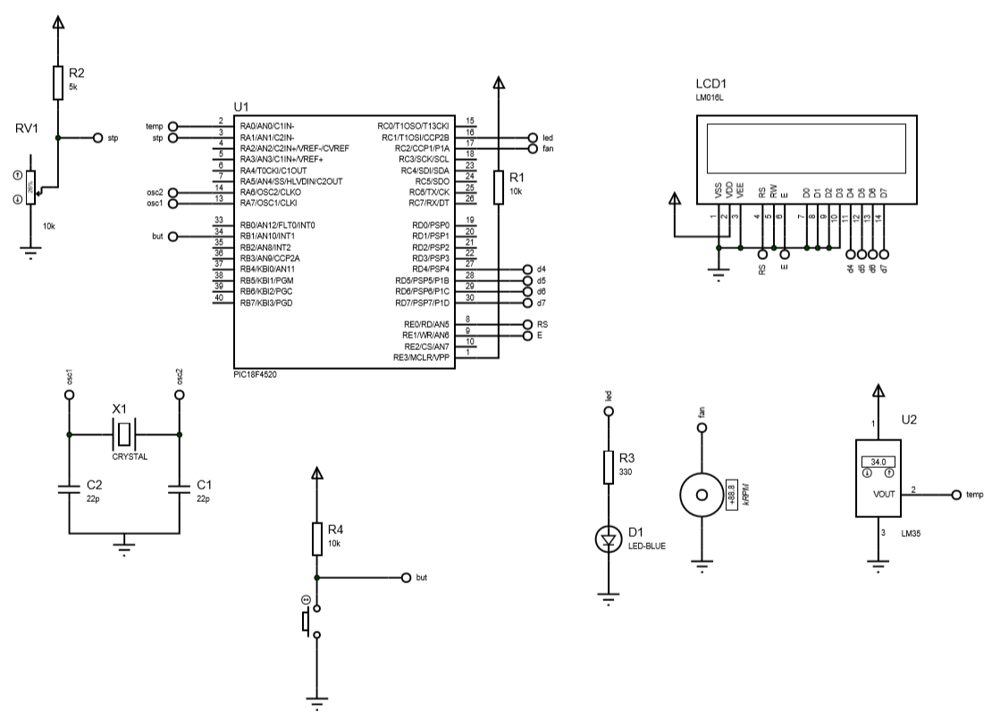

# PID com a placa de Treinamento ACEPIC

Objetivo: Deixar um resistor colado a um LM35 com a mesma temperatura de operação graças a um controlador PID, resistor esse que está constantemente recebendo a mesma corrente elétrica.

Esquema elétrico da placa de treinamento pode ser vista em ./documents/Esquema ACEPIC PRO V20.pdf

Biblioteca externa necessária: lcd_4g.h que define as portas do lcd utilizado na placa (16 x 2) além de algumas funçoes de uso

Além das bibliotecas adc, delays, stdio e e do próprio mapeamento do pic usado que é o p18F4520 que estão presentes na IDE do MPLAB usado para compilar o código, o código ADC.c não é para esse projeto e sim um código de referência

## Esquema elétrico usado



Onde o sistema de refrigeração é uma fan (de pc comum) e o sensor LM35 informa ao PIC o quanto de temperatura o resistor R3 com o led (para informar que tinha corrente passando por ali), o push button servia para setarmos as constante KP, KD e KI do controlador (setava o menu do lcd e com isso poderiamos mudar as variaveis) e o potenciômetro para aumentar ou diminuir a temperatura que o resistor deveria ficar

## PID

Basicamente o PID está nesse código

```c
		AD=(temp-temp2)*KD;               //Determinacao do AD 
        ADi=(int)AD;

	//	temp_old=temp;
		
		erro=stp-temp;
		erroi=(int)erro;

		AP=KP*erro;               			//Determinacao do AP 
		APi=(int) AP;
		I=I+erro;
		
		if (AI>100)
			AI = 100;
	
		if(AI<-50)
			AI= -50;
		

		AI=(KI*erro)+AI;               				//Determinacao do AI           PROVA
		AIi=(int)AI;
		
//-------------------------------------------------------------------

		vm=AP+AI+AD;
		vmi=(int)vm;
		pwm();
```

Onde vm era o número que seria passado ao ventilador que aumenta e diminui a velocidade para colocar o resistor na temperatura desejada.
